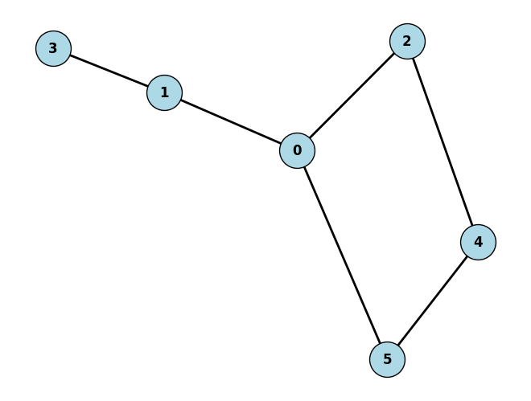

# Filas, Pilhas e Grafos

Neste diretório apresentamos uma implementação simples das estruturas de dados `Stack`, `Queue` e `Graph`, além de algoritmos de busca em largura (BFS) e busca em profundidade (DFS), utilizando a biblioteca `stdio.h` (apenas a função `printf`) em C++. Essa abordagem não utilizará recursos avançados da linguagem, como containers da STL, garantindo que utilizaremos apenas recursos básicos.

### 1. Classe `Stack`:
Uma pilha (stack) segue a abordagem LIFO (Last In, First Out), ou seja, o último elemento inserido é o primeiro a ser removido.

```cpp
class Stack {
private:
    int arr[MAX_SIZE_STACK];
    int top;
    
public:
    Stack() {
        top = -1;
    }
    
    bool isEmpty() {
        return top == -1;
    }
    
    bool isFull() {
        return top == MAX_SIZE_STACK - 1;
    }
    
    void push(int value) {
        if (!isFull()) {
            arr[++top] = value;
        } else {
            printf("Pilha cheia!\n");
        }
    }
    
    int pop() {
        if (!isEmpty()) {
            return arr[top--];
        } else {
            printf("Pilha vazia!\n");
            return -1; // Indica que não há elementos para remover
        }
    }
    
    int peek() {
        if (!isEmpty()) {
            return arr[top];
        } else {
            printf("Pilha vazia!\n");
            return -1;
        }
    }
};
```

### 2. Classe `Queue`:
Uma fila (queue) segue a abordagem FIFO (First In, First Out), ou seja, o primeiro elemento inserido é o primeiro a ser removido.

```cpp
class Queue {
private:
    int arr[MAX_SIZE_QUEUE];
    int rear;
    
public:
    Queue() {
        rear = 0;
    }
    
    bool isEmpty() {
        return rear == 0;
    }
    
    bool isFull() {
        return rear == MAX_SIZE_QUEUE - 1;
    }
    
    void enqueue(int value) {
        if (isFull()) {
            printf("Fila cheia!\n");
        } else {
            arr[rear] = value;
            rear++;
        }
    }
    
    int dequeue() {
        if (isEmpty()) {
            printf("Fila vazia!\n");
            return -1;
        } else {
            int dequeuedValue = arr[0];
            for (int i=0; i < rear; i++) {
                arr[i] = arr[i+1];
            }
            rear--;
            return dequeuedValue;
        }
    }
    
    int peek() {
        if (isEmpty()) {
            printf("Fila vazia!\n");
            return -1;
        } else {
            return arr[0];
        }
    }
};
```

### 3. Classe `Graph`:
O grafo será representado usando uma matriz de adjacências. Essa estrutura não é otimizada em termos de memória, mas é simples e eficiente para representar grafos pequenos.

```cpp
class Graph {
private:
    int adjMatrix[MAX][MAX];
    int V; // Número de vértices
    
public:
    Graph(int vertices) {
        V = vertices;
        
        // Inicializa a matriz de adjacências com 0 (nenhuma aresta)
        for (int i = 0; i < V; i++) {
            for (int j = 0; j < V; j++) {
                adjMatrix[i][j] = 0;
            }
        }
    }
    
    void addEdge(int u, int v) {
        adjMatrix[u][v] = 1; // Adiciona uma aresta de u para v
        adjMatrix[v][u] = 1; // Para grafos não direcionados
    }
    
    void BFS(int start) {
        bool visited[MAX] = { false };
        Queue q;
        
        visited[start] = true;
        q.enqueue(start);
        
        printf("BFS a partir do vértice %d: ", start);
        
        while (!q.isEmpty()) {
            int current = q.dequeue();
            printf("%d ", current);
            
            // Visita todos os vizinhos não visitados
            for (int i = 0; i < V; i++) {
                if (adjMatrix[current][i] == 1 && !visited[i]) {
                    visited[i] = true;
                    q.enqueue(i);
                }
            }
        }
        printf("\n");
    }
    
    void DFS(int start) {
        bool visited[MAX] = { false };
        Stack s;
        
        s.push(start);
        
        printf("DFS a partir do vértice %d: ", start);
        
        while (!s.isEmpty()) {
            int current = s.pop();
            
            if (!visited[current]) {
                visited[current] = true;
                printf("%d ", current);
            }
            
            // Empilha os vizinhos não visitados
            for (int i = 0; i < V; i++) {
                if (adjMatrix[current][i] == 1 && !visited[i]) {
                    s.push(i);
                }
            }
        }
        printf("\n");
    }
};
```

### 4. Função `main` para testar a implementação:

```cpp
int main() {
    Graph g(6); // Grafo com 5 vértices
    
    // Adicionando arestas
    g.addEdge(0, 1);
    g.addEdge(0, 2);
    g.addEdge(0, 5);
    g.addEdge(1, 3);
    g.addEdge(2, 4);
    g.addEdge(4, 5);
    
    // Testando BFS e DFS
    g.BFS(0); // Busca em largura a partir do vértice 0
    g.DFS(0); // Busca em profundidade a partir do vértice 0
    
    return 0;
}
```

### Explicação:

- **Stack (Pilha)**: A classe `Stack` usa um vetor para armazenar os elementos. O método `push()` insere um elemento no topo, `pop()` remove o topo e `peek()` retorna o elemento no topo sem removê-lo.
  
- **Queue (Fila)**: A classe `Queue` usa um vetor e dois índices (`front` e `rear`) para gerenciar a fila. `enqueue()` adiciona um item no final, `dequeue()` remove o item do início, e `peek()` mostra o item do início.

- **Graph (Grafo)**: A classe `Graph` utiliza uma matriz de adjacência para representar o grafo, onde `1` indica a presença de uma aresta e `0` indica a ausência. As funções `BFS()` e `DFS()` implementam as buscas em largura e em profundidade, respectivamente.

### Como executar:
Você pode compilar e rodar o código em qualquer compilador C++ que suporte a biblioteca `stdio.h`, como o `g++`. Ele irá gerar as saídas da BFS e DFS a partir do vértice `0`.

```bash
g++ -o graph main.cpp
./graph
```

### Saída esperada:

```
BFS a partir do vértice 0: 0 1 2 5 3 4
DFS a partir do vértice 0: 0 5 4 2 1 3
```

Essa implementação é bem simples e pode ser expandida conforme a necessidade, mas atende ao pedido inicial utilizando apenas `stdio.h` e funcionalidades básicas de C++.


---

### Grafo de Teste

O grafo do teste `main.cpp` pode ser visualizado a seguir:



Para realizar este tipo de plot use a libraries Networkx e Matplotlib em Python:
```py
import networkx as nx
import matplotlib.pyplot as plt

# Criação do grafo
G = nx.Graph()

# Adicionando arestas
G.add_edge(0, 1)
G.add_edge(0, 2)
G.add_edge(0, 5)
G.add_edge(1, 3)
G.add_edge(2, 4)
G.add_edge(4, 5)

# Configurações de estilo
nx.draw(G, 
        with_labels=True, 
        node_color='lightblue',
        node_size=1000, 
        font_size=12, 
        font_weight='bold', 
        edgecolors='black',    # Cor da borda dos vértices
        width=2)               # Espessura das arestas

# Exibe o gráfico
plt.show()
```

---